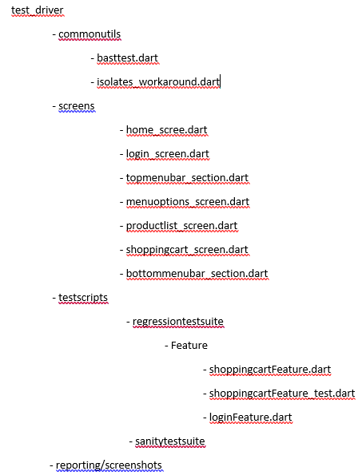
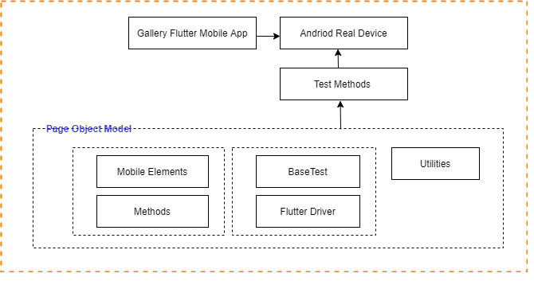

## ## ## ## Gallery application test automation ## ## ## ## ##

## Getting Started
Demonstrate automation testing of "Flutter Gallery" application in Android with Flutter driver!!
The Goal is to write automated test cases on real devices of "Flutter_Gallary" application. 

The Source code & binaries are available at " https://github.com/flutter/gallery "

------------------------------------------------------------------------------------------------------------------------------------------------------------
## Requirements
Automate the below
"user is adding some items to the shopping cart" scenario.
For example:
1. Opening the Shrine Gallery
2. Adding the Walter henley (white) shirt to cart after going to the Clothing filter
3. Adding the Shrug bag after using the Accessories filter
4. Checking the total of the shopping cart
5. Clearing the shopping cart

------------------------------------------------------------------------------------------------------------------------------------------------------------
## Tools / Technologies
To overcome the below mentioned challenges in Challenges section, used the below technology stack. 
1. Android Studio
2. Flutter SDK
3. Android SDK
4. adb
5. Dart
6. Debugger tool - Dev Tool/Flutter Inspector

------------------------------------------------------------------------------------------------------------------------------------------------------------
## Setup
1. Download Android SDK and setup as per given steps
2. Download the Flutter SDK and put at desired folder like :C:/Flutter_SDK/
3. Set all the paths in Environment variables
4. Add all necessary plugins
5. adb to connect Android devices
6. Setup DevTool
7. Clone the Flutter Gallery project at desired location
8. Setup project in Android Studio and resolve all dependencies
7. Add below code snippet in pubspec.yaml file
         dev_dependencies:
         flutter_driver:
         sdk: flutter
         test: any
8. Resolve all dependencies from pubspec.yaml
9. Run the main.dart class from lib, to get the code compiled and clean
10. Add "enableFlutterDriverExtension();" in main() of shoppingcartFeature.dart, to enable the flutter extension Also import the import 'package:flutter_driver/driver_extension.dart';

Reference URL: https://flutter.dev/docs/get-started/install

------------------------------------------------------------------------------------------------------------------------------------------------------------
## Structure
1. Used Page Object Model design pattern to automated the integration test of Flutter Gallery app.
2. Under test_driver folder, complete test automation structure and test script are as follows
   Project_Test_Structure 

   - basttest.dart : this file contains all common pre-requisites to run the test activities like - Flutter driver initialization & connection, setUpAll, teardown, health of          flutter driver, launch of application.
   - isolates_workaround.dart : this file contains the fix for abnormal behaviour of application. Workaround for bug: https://github.com/flutter/flutter/issues/24703
   - home_scree.dart (all files...) : these files provided locators/elements and their methods. It is best practice to maintain the code.
   - shoppingcartFeature.dart : this is use to have instrument the app. Build & install the debug build in targeted attached device.
   - shoppingcartFeature_test.dart : This is test script file which contain execution steps of test scenario.

PageObjectModel 

3. Test Cases with scenrioes & steps:

| Sr.no | Scenarios                                                                  | Expected Result                                                                                                            | Actual Result |
| ----- | -------------------------------------------------------------------------- | -------------------------------------------------------------------------------------------------------------------------- | ------------- |
| 1     | Launch application by tapping on 'Flutter Gallery' icon on targeted device | Application should be launched successfully & user should be navigated on Gallery home screen                              | pass          |
| 2     | Validate the 'Gallery' heading on home screen                              | Gallery heading on home screen should be visible to user                                                                   | pass          |
| 3     | Tap on Shrine Card image on home screen                                    | User should be navigated to login screen                                                                                   | pass          |
| 4     | Validate the 'Next' button on login screen                                 | Next button on login screen should be visible to user                                                                      | pass          |
| 5     | Enter 'abc' in Username text box                                           | abc' should be entered in the Username text box                                                                            |               |
| 6     | Enter 'abc' in Password text box                                           | abc' should be entered in the Password text box                                                                            |               |
| 7     | Tap on 'Next' button on login screen                                       | User should be navigated to product-list screen                                                                            | pass          |
| 8     | Validate the 'SHRINE' title text at the top of the screen                  | SHRINE title text at the top of the screen on product-list screen should be visible to user                                | pass          |
| 9     | Tap on hamburger icon from the top menu bar                                | Menu option screen should be  displayed                                                                                    | pass          |
| 10    | Validate the CLOTHING option                                               | CLOTHING option should be visible to user                                                                                  | pass          |
| 11    | Tap on  CLOTHING option                                                    | User should be navigated to  product-list screen of clothing category                                                      | pass          |
| 12    | Scroll until to get the clothing item 'Walter henley (white)'              | Screen should be scrolled until get the product 'Walter henley (white)' and should be stopped once get the product         | pass          |
| 13    | Tap on clothing product 'Walter henley (white)'                            | The clothing product should be added in shopping cart                                                                      | pass          |
| 14    | Tap on hamburger icon from the top menu bar                                | Menu option screen should be  displayed                                                                                    | pass          |
| 15    | Validate the ACCESSORIES option                                            | ACCESSORIES option should be visible to user                                                                               | pass          |
| 16    | Tap on  ACCESSORIES option                                                 | User should be navigated to  product-list screen of accessories category                                                   | pass          |
| 17    | Scroll until to get the clothing item 'Shrug bag'                          | Screen should be scrolled until get the product 'Shrug bag' and should be stopped once found the product                   | pass          |
| 18    | Tap on Shopping Cart icon at the bottom of the product-list screen         | User should be navigated on cart screen                                                                                    | pass          |
| 19    | Validate the button 'CLEAR CART'                                           | CLEAR CART'  button should be visible to user                                                                              | pass          |
| 20    | Validate the 'TOTAL' value on cart screen                                  | TOTAL amount should be displayed                                                                                           | pass          |
| 21    | Tap on 'CLEAR CART'  button to clear cart                                  | User should be navigated on previous screen, product-list screen                                                           | pass          |
| 22    | Validate the SHRINE title text at the top of the screen                    | SHRINE title text at the top of the screen on product-list screen should be visible to user                                | pass          |
| 23    | Validate shopping cart is empty                                            | User should not see any items added in shopping cart 1\. 'No ITEMS' text 2\. $0.00 total 3\. No product available | pass          |

------------------------------------------------------------------------------------------------------------------------------------------------------------
## Execution
1. Connect computer to a real Android device
2. Check the connection by using adb devices on cmd
3. Run the following command from the root of the project - <flutter drive --target=test_driver/testscripts/regressiontestsuite/Features/shoppingcartFeature.dart>
4. Step 3 will install the debug.apk/build in the attached device and then test start execution.
4. Execution happens and logs get generated in Console.

Reference URL: https://flutter.dev/docs/cookbook/testing/integration/introduction

------------------------------------------------------------------------------------------------------------------------------------------------------------
## Reporting
Currently we can see execution in the console window. Used the print command to print the logs. Need to explore how to do reporting for this Integration Test

------------------------------------------------------------------------------------------------------------------------------------------------------------
## Point to be noted
1. Updated some Keys/text locator to access elements of the screens and perform the certain actions

------------------------------------------------------------------------------------------------------------------------------------------------------------
## Challenges
1. Appium driver automation will not work as the given applications/ binaries do not have Key values/identifire, which are used to identify the objects on the screen. In this Flutter Gallery application we are blocked on Product screen due to not getting identifiers. Widget is not exposing the proper locators. As result we are blocked to automated the next steps.
2. Appium Flutter Driver is not recognizing Key values by FlutterElement/FlutterFinder using Java and hence as result we are blocked to automated the application scenarios.

------------------------------------------------------------------------------------------------------------------------------------------------------------
## Video of test execution

